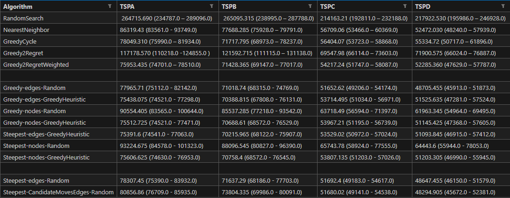
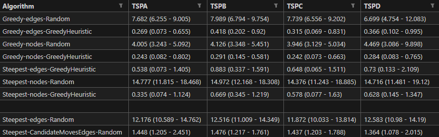

# Report

Team members:

- Sofya Aksenyuk, 150284
- Uladzimir Ivashka, 150281

## Problem Description

Given a set of nodes, each characterized by their (x, y) coordinates in a plane and an associated cost, the challenge is to select exactly 50% of these nodes and form a Hamiltonian cycle. 

The goal is to minimize the sum of the total length of the path plus the total cost of the selected nodes. 

Distances between nodes are computed as Euclidean distances and rounded to the nearest integer. 

## Methodologies

### Steepest Local Search with Candidate Moves

Steepest Local Search systematically examines all possible moves within the neighborhood, both intra-route and inter-route, and selects the move that results in the best improvement in the objective function value. 

It aims to find the absolute best move at each step.

Candidate Moves method modifies the Steepest Local Search by incorporating candidate moves, focusing on improving time efficiency while maintaining solution quality. 

It generates an initial random solution, then for each node in the current solution, the algorithm identifies candidate moves by considering the ten nearest vertices based on the sum of edge length and vertex cost. 

The search then encompasses both intra-route (two-edge exchange) and inter-route (node exchange) moves, ensuring at least one candidate edge is introduced in each move. 

This approach aims to limit the search space to more promising moves, this way enhancing the efficiency of finding an improved solution while maintaining a comprehensive exploration of potential improvements, and significantly improving the time complexity.

## Source code

Link: [Source Code](https://github.com/aksenyuk/evolutionary-computation/blob/main/candidate-moves/candidate-moves.ipynb)

## Pseudocode

### Steepest Local Search with Candidate Moves

    Function SteepestLocalSearchCandidateMoves(DistanceMatrix, Costs, CandidateMoves):

        CurrentSolution = (generate initial solution using RandomSearch)
        Improved = True

        While Improved:
            Improved = False
            BestDelta = 0
            BestSolution = None

            For each CurrentNode in CurrentSolution:
                For each Candidate in CandidateMoves[CurrentNode]:

                    If (Candidate in CurrentSolution):
                        If (Candidate not neighbor with CurrentNode):
                            Swaps = (generate 2 edge swaps, so Candidate become neighbor of CurrentNode)
                            For each Swap in Swaps:
                                Delta, NewSolution = CalculateEdgeSwapDelta(CurrentSolution, Swap, DistanceMatrix, Costs)
                                If Delta > BestDelta:
                                    BestSolution = NewSolution
                                    BestDelta = Delta

                    Else:
                        Swaps = (generate 2 inter node swaps, so Candidate become neighbor of CurrentNode)
                        For each Swap in Swaps:
                            Delta, NewSolution = CalculateNodeSwapDelta(CurrentSolution, Swap, DistanceMatrix, Costs)
                            If Delta > BestDelta:
                                BestSolution = NewSolution
                                BestDelta = Delta

            If (BestSolution != None):
                CurrentSolution = BestNeighbor
                Improved = True
                        
            Return CurrentSolution

# Computational Experiments

## Results

### Table of Cost

### Table of Time

## Best Solutions Plots

See plots: [Plots](https://github.com/aksenyuk/evolutionary-computation/tree/main/candidate-moves/plots/)

# Best solution among all methods so far

## TSPA

[42, 89, 94, 12, 72, 190, 98, 66, 156, 6, 24, 141, 144, 87, 79, 194, 21, 171, 154, 81, 62, 108, 15, 117, 53, 22, 195, 55, 36, 132, 128, 25, 181, 113, 74, 163, 61, 71, 20, 64, 185, 96, 27, 116, 147, 59, 143, 159, 164, 178, 19, 0, 149, 50, 121, 91, 114, 4, 77, 43, 192, 175, 153, 88, 127, 186, 45, 167, 101, 60, 126, 174, 199, 41, 177, 1, 75, 189, 109, 130, 152, 11, 48, 106, 26, 119, 134, 99, 135, 51, 5, 112, 73, 31, 95, 169, 8, 80, 14, 111]

**Cost:** 74541.0

## TSPB
    
[158, 162, 150, 44, 117, 196, 192, 21, 142, 130, 174, 51, 91, 70, 140, 148, 141, 53, 69, 115, 82, 63, 8, 14, 16, 172, 95, 163, 182, 2, 5, 34, 183, 197, 179, 31, 101, 42, 38, 103, 131, 121, 24, 127, 143, 122, 92, 26, 66, 169, 99, 50, 154, 134, 25, 36, 165, 37, 137, 88, 55, 4, 153, 145, 157, 80, 57, 0, 135, 198, 190, 19, 29, 33, 136, 61, 73, 185, 132, 18, 52, 12, 107, 139, 193, 119, 59, 71, 166, 85, 64, 147, 159, 89, 129, 58, 171, 72, 114, 67]

**Cost:** 68122.0

## TSPC
    
[81, 171, 108, 62, 15, 117, 53, 22, 55, 195, 74, 163, 113, 132, 128, 40, 164, 178, 19, 35, 69, 0, 149, 50, 121, 91, 114, 175, 2, 4, 77, 43, 192, 150, 199, 39, 174, 137, 41, 177, 1, 75, 189, 109, 130, 152, 11, 160, 106, 48, 92, 26, 119, 134, 139, 95, 169, 110, 8, 80, 31, 73, 89, 42, 94, 12, 72, 98, 156, 172, 6, 66, 190, 112, 5, 51, 135, 99, 101, 9, 60, 167, 153, 88, 127, 45, 186, 170, 129, 157, 21, 194, 79, 87, 141, 144, 102, 44, 133, 154]

**Cost:** 50972.0

## TSPD
    
[87, 147, 159, 64, 129, 89, 58, 171, 72, 114, 85, 166, 28, 59, 119, 193, 71, 44, 162, 150, 117, 196, 192, 21, 138, 142, 130, 161, 174, 188, 140, 148, 141, 53, 96, 32, 113, 69, 115, 82, 63, 8, 14, 84, 139, 97, 107, 12, 52, 132, 18, 16, 172, 95, 19, 190, 198, 135, 128, 66, 169, 0, 57, 99, 92, 122, 143, 179, 121, 127, 24, 50, 112, 154, 134, 25, 36, 194, 123, 165, 37, 146, 137, 88, 55, 4, 153, 80, 157, 145, 79, 136, 61, 73, 185, 47, 189, 170, 181, 187]

**Cost:**  46915.0

# Conclusions

## Efficiency of Candidate Moves

### Cost Comparison

Steepest-CandidateMovesEdges-Random exhibits a **slightly** higher cost in TSP instances A, B, and D compared to Steepest-edges-Random. However, this difference is minimal.

This indicates that while the introduction of candidate moves aimed at efficiency, it may not always translate into a lower cost.

In instance C, both methods show almost the same cost, suggesting that the effect of candidate moves on solution cost is context-dependent and might vary with different landscapes.

### Time Efficiency

There is a significant reduction in computation time with Steepest-CandidateMovesEdges-Random across all instances compared to Steepest-edges-Random. 

This aligns with the primary goal of the new method, indicating a notable improvement in time efficiency due to the introduction of candidate moves.

The narrower range in computation times for Steepest-CandidateMovesEdges-Random also suggests a more consistent performance in terms of time efficiency.
