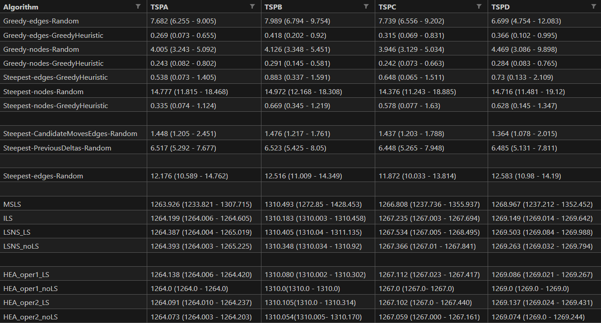
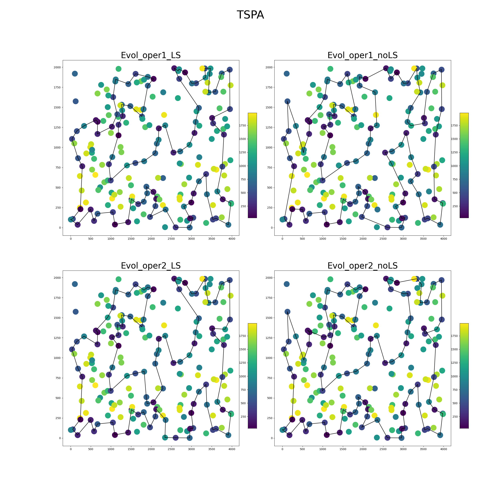
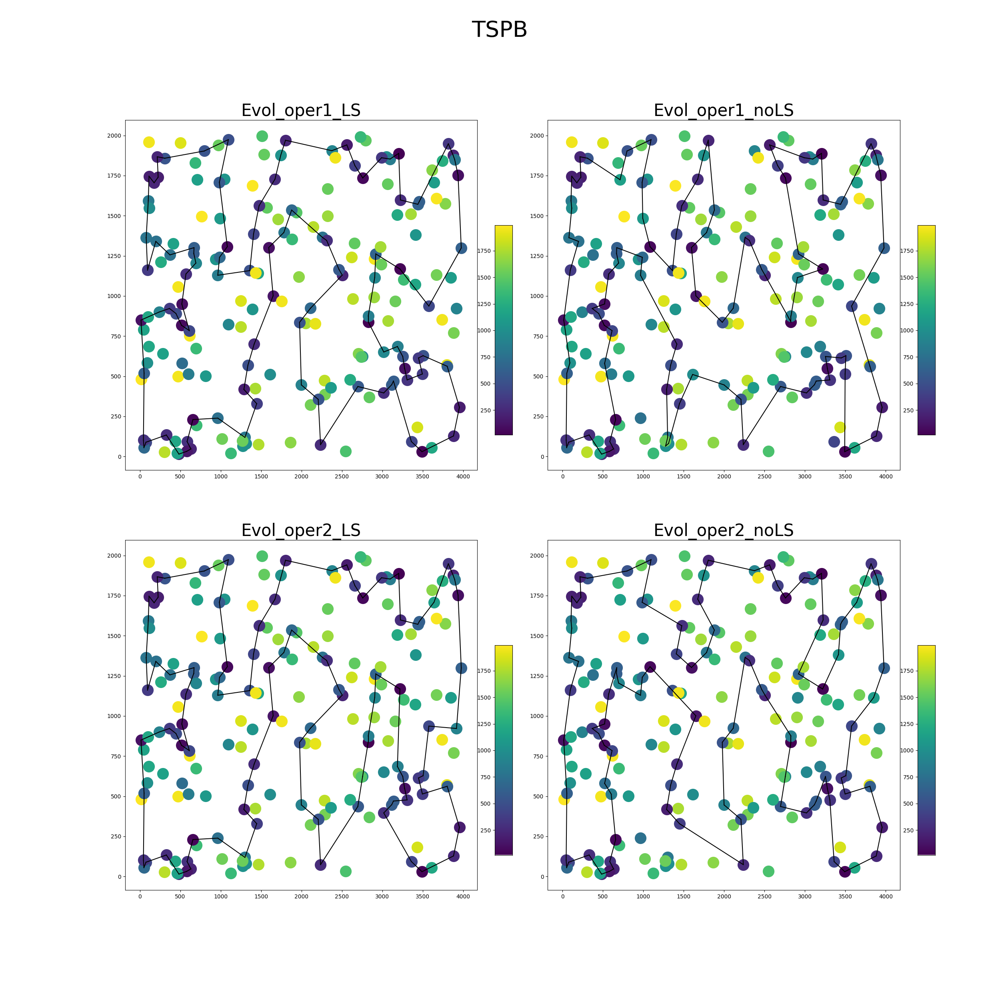
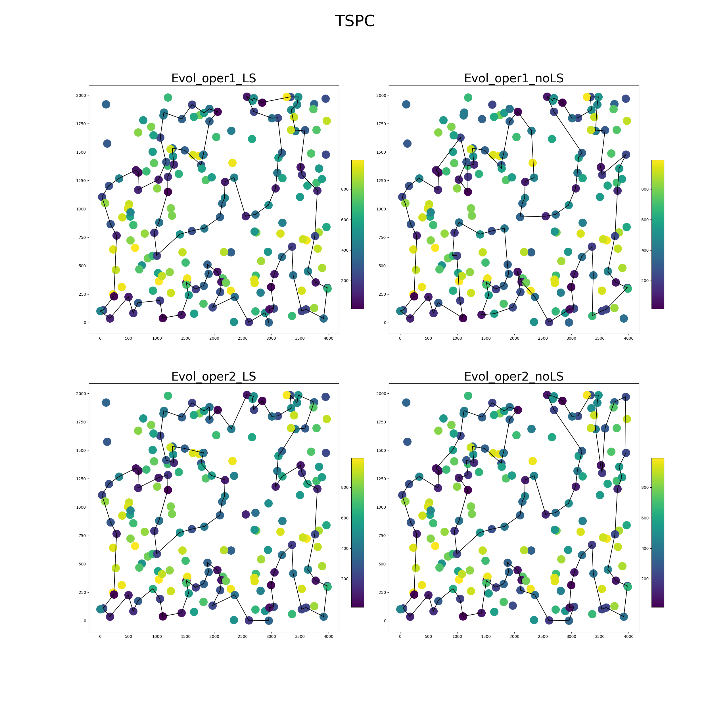
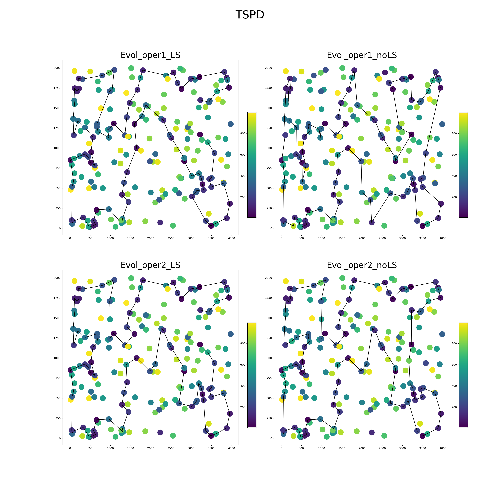
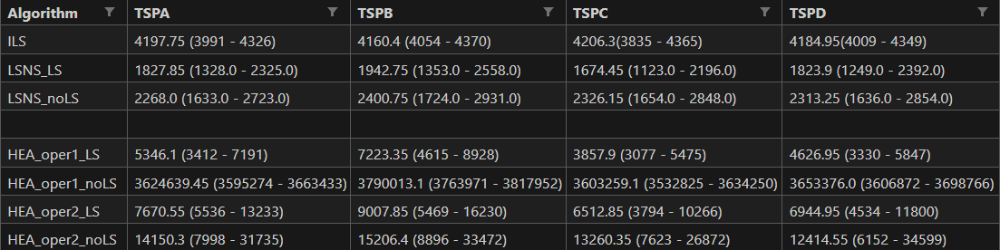

# Report

Team members:

- Sofya Aksenyuk, 150284
- Uladzimir Ivashka, 150281

## Problem Description

Given a set of nodes, each characterized by their (x, y) coordinates in a plane and an associated cost, the challenge is to select exactly 50% of these nodes and form a Hamiltonian cycle. 

The goal is to minimize the sum of the total length of the path plus the total cost of the selected nodes. 

Distances between nodes are computed as Euclidean distances and rounded to the nearest integer. 

## Methodology

### Hybrid Evolutionary Algorithm

In Hybrid Evolutionary Algorithms evolutionary approaches are combined with other optimization methods. This can include techniques like Local Search, which refines individual solutions, or machine learning methods that guide the search process. In this assignment, we will stick to Local Search solution, particularly Steepest Local Search.

## Source code

Link: [Source Code](https://github.com/aksenyuk/evolutionary-computation/blob/main/large-scale-neighborhood-search/hybrid-evol-algo/hybrid_evol_algo.ipynb)

## Pseudocode

## Hybrid Evolutionary Algorithm

FUNCTION HEA(DistanceMatrix, Costs, EndTime, PopSize, Oper, UseLocal):

    StartTime = time()
    Counter = 0

    Population = (generate 20 solutions using SteepestLocalSearch)
    TotalCosts = (compute total costs for each of the solutions from population)

    WHILE (time() - StartTime < EndTime):
        Parent1, Parent2 = (uniformly randomly choose 2 different solutions from population)

        IF (Oper = 1):
            Child = Operator_1(Parent1, Parent2)
        ELSE IF (Oper = 2):
            Child = Operator_2(Parent1, Parent2)

        IF (UseLocal is True):
            Child = SteepestLocalSearch(Child, DistanceMatrix, Costs)

        ChildTotalCost = GetTotalCost(Child, DistanceMatrix, Costs)
        IF (ChildTotalCost not it TotalCosts):
            MaxTotalCost, Idx = (get worst total cost and its index)
            IF (ChildTotalCost < MaxTotalCost):
                Population[Idx] = Child
                TotalCosts[Idx] = ChildTotalCost

        Counter += 1

    BestSolution, BestTotalCost = (get best solution from population and its total cost)

    RETURN BestSolution, BestTotalCost, Counter

Operator_1(Parent1, Parent2):
    - get all common edges and nodes
    - place all common edges in empty child in places as they are in one of parents
    - place all remain common nodes in respective places
    - fill empty places randomly, so that there are no repetitions

Operator_2(Parent1, Parent2):
    - get all common edges and nodes
    - remove from one parent all nodes and edges that are not in common
    - apply Greedy-2-regret-weighted to complete solution

# Computational Experiments

## Results

### Table of Cost

### Table of Time

## Best Solutions Plots

See plots: [Plots](https://github.com/aksenyuk/evolutionary-computation/tree/main/large-scale-neighborhood-search/plots/)

### Number of riterations

# Best solution among all methods so far

## TSPA
[48, 106, 160, 11, 152, 130, 119, 109, 189, 75, 1, 177, 41, 137, 199, 192, 175, 114, 4, 77, 43, 121, 91, 50, 149, 0, 19, 178, 164, 159, 143, 59, 147, 116, 27, 96, 185, 64, 20, 71, 61, 163, 74, 113, 195, 53, 62, 32, 180, 81, 154, 144, 141, 87, 79, 194, 21, 171, 108, 15, 117, 22, 55, 36, 132, 128, 145, 76, 161, 153, 88, 127, 186, 45, 167, 101, 99, 135, 51, 112, 66, 6, 172, 156, 98, 190, 72, 12, 94, 89, 73, 31, 111, 14, 80, 95, 169, 8, 26, 92]

**Cost:** 72855.0

## TSPB
[166, 59, 119, 193, 71, 44, 196, 117, 150, 162, 158, 67, 156, 91, 70, 51, 174, 140, 148, 141, 130, 142, 53, 69, 115, 82, 63, 8, 16, 18, 29, 33, 19, 190, 198, 135, 95, 172, 163, 182, 2, 5, 34, 183, 197, 31, 101, 38, 103, 131, 24, 127, 121, 179, 143, 122, 92, 26, 66, 169, 0, 57, 99, 50, 112, 154, 134, 25, 36, 165, 37, 137, 88, 55, 153, 80, 157, 145, 79, 136, 73, 185, 132, 52, 139, 107, 12, 189, 170, 181, 147, 159, 64, 129, 89, 58, 171, 72, 114, 85]    

**Cost:** 66117.0

## TSPC
[20, 71, 61, 163, 74, 113, 195, 53, 62, 32, 180, 81, 154, 102, 144, 141, 87, 79, 194, 21, 171, 108, 15, 117, 22, 55, 36, 132, 128, 145, 76, 161, 153, 88, 127, 186, 45, 167, 101, 99, 135, 51, 5, 112, 72, 190, 66, 6, 172, 156, 98, 94, 42, 89, 12, 73, 31, 95, 169, 8, 26, 92, 48, 106, 160, 11, 152, 130, 119, 109, 189, 75, 1, 177, 41, 137, 199, 192, 43, 77, 4, 114, 91, 121, 50, 149, 0, 69, 19, 178, 164, 159, 143, 59, 147, 116, 27, 96, 185, 64]

**Cost:** 46777.0

## TSPD
[47, 170, 181, 147, 159, 64, 129, 89, 58, 171, 72, 114, 85, 166, 71, 44, 196, 117, 150, 162, 158, 67, 3, 156, 91, 70, 51, 174, 140, 148, 141, 130, 142, 53, 32, 113, 69, 115, 82, 63, 8, 16, 18, 29, 33, 19, 190, 198, 135, 169, 66, 26, 92, 122, 143, 179, 197, 183, 34, 31, 101, 38, 103, 131, 121, 127, 24, 50, 43, 99, 137, 37, 165, 123, 154, 134, 25, 36, 88, 55, 4, 153, 80, 157, 145, 79, 136, 61, 73, 185, 132, 52, 12, 107, 97, 139, 193, 119, 59, 189]  

**Cost:** 43181.0

# Conclusions

