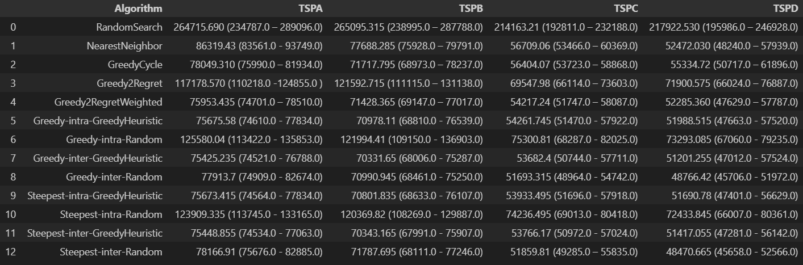
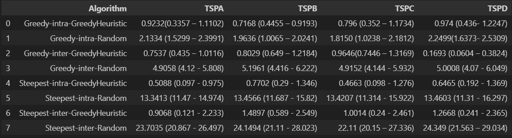

# Report

Team members:

- Sofya Aksenyuk, 150284
- Uladzimir Ivashka, 150281

## Problem Description

Given a set of nodes, each characterized by their (x, y) coordinates in a plane and an associated cost, the challenge is to select exactly 50% of these nodes and form a Hamiltonian cycle. 

The goal is to minimize the sum of the total length of the path plus the total cost of the selected nodes. 

Distances between nodes are computed as Euclidean distances and rounded to the nearest integer. 

## Methodologies

### Greedy Local Search

This algorithm repeatedly makes random selections of moves (intra-route or inter-route) to explore and improve a solution. 

It aims to diversify the search and potentially find better solutions by introducing randomness into the order of exploration.

### Steepest Local Search

This algorithm systematically examines all possible moves within the neighborhood, both intra-route and inter-route, and selects the move that results in the best improvement in the objective function value. 

It aims to find the absolute best move at each step.

## Source code

Link: [Source Code](https://github.com/aksenyuk/evolutionary-computation/blob/main/local-search/local-search.ipynb)

## Pseudocode

### Greedy Local Search

    Function GreedyLocalSearch(DistanceMatrix, Costs):
        CurrentSolution = (generate initial solution using RandomSearch/GreedyHeuristic)
        Improved = True
        
        While Improved:
            NeighborsNodeSwap = (generate all possible inter/intra node swaps)
            NeighborsEdgeSwap = (generate all possible inter/intra node swaps)
            Neighbors = NeighborsNodeSwap + NeighborsEdgeSwap
            Neighbors = Shuffle(Neighbors)
            Improved = False
            
            For each Neighbor in Neighbors:
                If (Neighbor is node swap):
                    Delta = CalculateNodeSwapDelta(CurrentSolution, DistanceMatrix, Costs)
                If (Neighbor is edge swap):
                    Delta = CalculateEdgeSwapDelta(CurrentSolution, DistanceMatrix, Costs)
                If Delta > 0:
                    CurrentSolution = Neighbor
                    Improved = True
                    Break
                    
        Return CurrentSolution

### Steepest Local Search

    Function SteepestLocalSearch(DistanceMatrix, Costs):
        CurrentSolution = (generate initial solution using RandomSearch/GreedyHeuristic)
        Improved = True
        
        While Improved:
            NeighborsNodeSwap = (generate all possible inter/intra node swaps)
            NeighborsEdgeSwap = (generate all possible inter/intra node swaps)
            Neighbors = NeighborsNodeSwap + NeighborsEdgeSwap
            Improved = False
            
            BestNeighbor = CurrentSolution
            BestDelta = 0
            
            For each Neighbor in Neighbors:
                If (Neighbor is node swap):
                    Delta = CalculateNodeSwapDelta(CurrentSolution, DistanceMatrix, Costs)
                If (Neighbor is edge swap):
                    Delta = CalculateEdgeSwapDelta(CurrentSolution, DistanceMatrix, Costs)
                If Delta > BestDelta:
                    BestNeighbor = Neighbor
                    BestDelta = Delta
            
            If BestNeighbor != CurrentSolution:
                CurrentSolution = BestNeighbor
                Improved = True
                    
        Return CurrentSolution

# Computational Experiments

## Results

### Table of Cost

### Table of Time

## Best Solutions Plots

See plots: [Plots](https://github.com/aksenyuk/evolutionary-computation/tree/main/local-search/plots/)

	

# Conclusions

## Performance

### Greedy vs. Steepest

The Steepest approach generally resulted in lower total costs compared to the Greedy approach. This indicates that Steepest, which considers all possible neighbor moves before making a decision, tends to find better solutions at the expense of higher computational time.

Among the Steepest and Greedy approaches, the ones initialized with a Greedy Heuristic (Greedy-intra-GreedyHeuristic, Greedy-inter-GreedyHeuristic, Steepest-intra-GreedyHeuristic, Steepest-inter-GreedyHeuristic) typically performed better than their counterparts started with a Random approach, indicating the importance of a good starting solution.

### Heuristic vs. Random Initial Solutions

Algorithms initialized with Greedy Heuristics outperformed those with Random initial solutions in terms of total cost, emphasizing the impact of a good starting point.

The consistency in solution quality was also better for algorithms that began with a Greedy Heuristic, suggesting that a good initial solution not only improves performance but also stability.

## Computational Time

### Greedy vs. Steepest Approaches

Greedy methods were faster but did not always provide solutions as good as those from the Steepest methods. 

The latter require more time because they perform a more exhaustive search within the neighborhood before making a move.

The increased time for Steepest Descent methods is justified by the improved solution quality, making them suitable for scenarios where the quality of the solution is paramount and time is a secondary concern.

### Heuristic vs. Random Initial Solutions

Starting with Greedy Heuristics generally led to faster convergence compared to Random initial solutions. 

This is likely because Greedy Heuristics begin the search closer to good local optima, reducing the number of iterations needed.

## Intra vs. Inter Neighborhoods

### Performance

Intra-neighborhood approaches (where the moves are restricted within the current solution) and inter-neighborhood approaches (where the moves can include swapping with elements outside the current solution) have shown competitive performances. 

However, the inter-neighborhood methods tend to provide slightly better solutions, possibly due to a broader search space.

### Computational Time

Inter-neighborhood searches generally took more time than intra-neighborhood searches. 

This is expected because inter-neighborhood searches have a larger search space to explore, thus requiring more computational effort.
