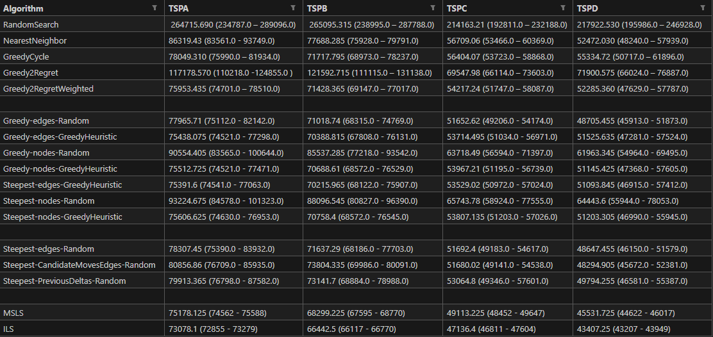
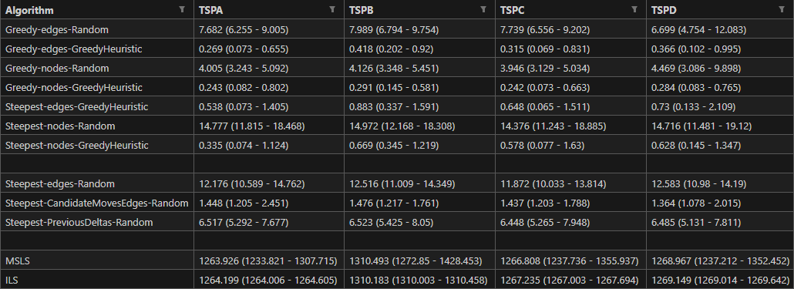
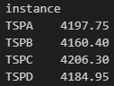

# Report

Team members:

- Sofya Aksenyuk, 150284
- Uladzimir Ivashka, 150281

## Problem Description

Given a set of nodes, each characterized by their (x, y) coordinates in a plane and an associated cost, the challenge is to select exactly 50% of these nodes and form a Hamiltonian cycle. 

The goal is to minimize the sum of the total length of the path plus the total cost of the selected nodes. 

Distances between nodes are computed as Euclidean distances and rounded to the nearest integer. 

## Methodology

### Multiple Start Local Search and Iterated Local Search

MSLS involves initiating the local search algorithm from multiple initial solutions, exploring different regions of the solution space simultaneously. 

This approach aims to diversify the search process, increasing the chances of finding high-quality solutions.

On the other hand, ILS is an iterative refinement technique that involves repeatedly applying a local search algorithm to the best solution found so far.

After reaching a local optimum, ILS introduces perturbations to escape the current solution and explores new regions of the solution space. 

This process helps to balance exploration and exploitation, allowing the algorithm to escape suboptimal solutions and potentially discover better solutions.

Both MSLS and ILS enhance the cost- and time-efficiency of local search algorithms.

## Source code

Link: [Source Code](https://github.com/aksenyuk/evolutionary-computation/blob/main/msls-ils/msls_ils.ipynb)

## Pseudocode

### Multiple Start Local Search

    FUNCTION MSLS(DistanceMatrix, Costs, NumRuns=200)

        BestTotalCost = Inf
        BestSolution = None

        FOR each Run in Range(NumRuns):
            Solution = RandomSearch()
            Solution = SteepestLocalSearch(Solution, DistanceMatrix, Costs)
            TotalCost = GetTotalCost(Solution, DistanceMatrix, Costs)
            IF (TotalCost < BestTotalCost):
                BestTotalCost = TotalCost
                BestSolution = Solution

        RETURN BestSolution, BestTotalCost

### Iterated Local Search 

    FUNCTION ILS(DistanceMatrix, Costs, EndTime):
        StartTime = time()
        BestSolution = RandomSearch()
        BestSolution = SteepestLocalSearch(BestSolution, DistanceMatrix, Costs)
        BestTotalCost = GetTotalCost(BestSolution, DistanceMatrix, Costs)
        Counter = 0

        WHILE (time() - StartTime < EndTime):
            SolutionPerturbed = Perturb(BestSolution)
            NewSolution = SteepestLocalSearch(SolutionPerturbed, DistanceMatrix, Costs)
            Counter += 1
            NewTotalCost = GetTotalCost(NewSolution, DistanceMatrix, Costs)

            IF (NewTotalCost < BestTotalCost):
                BestTotalCost = NewTotalCost
                BestSolution = NewSolution

        RETURN BestSolution, BestTotalCost, Counter

    FUNCTION Perturb(Solution):
        
        Randomly choose and apply to solution one of actions:

            1) Randomly selects n cities from the current solution and inserts them into random positions within the solution
            2) Divides the solution into four segments of random size, and then rearranges these segments in a specific order
            3) Selects a sub-tour of random length (between 5% to 15% of the total tour length) and shuffles the order of cities within this sub-tour
            4) Similar to the shuffle sub-tour, this perturbation also selects a sub-tour of random length. However, instead of shuffling, it removes this sub-tour from its original position and inserts it at a different random location in the solution
            5) Removes k edges in the solution, and the resulting segments are reconnected in a different order

# Computational Experiments

## Results

### Table of Cost

### Table of Time

## Best Solutions Plots

See plots: [Plots](https://github.com/aksenyuk/evolutionary-computation/tree/main/msls-ils/plots/)

# Best solution among all methods so far

## TSPA
[48, 106, 160, 11, 152, 130, 119, 109, 189, 75, 1, 177, 41, 137, 199, 192, 175, 114, 4, 77, 43, 121, 91, 50, 149, 0, 19, 178, 164, 159, 143, 59, 147, 116, 27, 96, 185, 64, 20, 71, 61, 163, 74, 113, 195, 53, 62, 32, 180, 81, 154, 144, 141, 87, 79, 194, 21, 171, 108, 15, 117, 22, 55, 36, 132, 128, 145, 76, 161, 153, 88, 127, 186, 45, 167, 101, 99, 135, 51, 112, 66, 6, 172, 156, 98, 190, 72, 12, 94, 89, 73, 31, 111, 14, 80, 95, 169, 8, 26, 92]

**Cost:** 72855.0

## TSPB
[166, 59, 119, 193, 71, 44, 196, 117, 150, 162, 158, 67, 156, 91, 70, 51, 174, 140, 148, 141, 130, 142, 53, 69, 115, 82, 63, 8, 16, 18, 29, 33, 19, 190, 198, 135, 95, 172, 163, 182, 2, 5, 34, 183, 197, 31, 101, 38, 103, 131, 24, 127, 121, 179, 143, 122, 92, 26, 66, 169, 0, 57, 99, 50, 112, 154, 134, 25, 36, 165, 37, 137, 88, 55, 153, 80, 157, 145, 79, 136, 73, 185, 132, 52, 139, 107, 12, 189, 170, 181, 147, 159, 64, 129, 89, 58, 171, 72, 114, 85]    

**Cost:** 66117.0

## TSPC
[61, 113, 74, 163, 155, 62, 32, 180, 81, 154, 102, 144, 141, 87, 79, 194, 21, 171, 108, 15, 117, 53, 22, 195, 55, 36, 132, 128, 145, 76, 161, 153, 88, 127, 186, 45, 167, 101, 99, 135, 51, 5, 112, 66, 6, 172, 156, 98, 190, 72, 12, 94, 89, 73, 31, 95, 169, 110, 8, 26, 92, 48, 106, 160, 11, 152, 130, 119, 109, 189, 75, 1, 177, 41, 137, 199, 192, 43, 77, 4, 114, 91, 121, 50, 149, 0, 19, 178, 164, 159, 143, 59, 147, 116, 27, 96, 185, 64, 20, 71]

**Cost:** 46811.0

## TSPD
[79, 145, 157, 80, 153, 4, 55, 88, 36, 25, 134, 154, 123, 165, 37, 137, 99, 92, 122, 143, 179, 121, 127, 24, 131, 103, 38, 101, 31, 197, 183, 34, 5, 128, 66, 169, 135, 198, 190, 19, 95, 172, 16, 8, 63, 82, 115, 69, 113, 53, 142, 130, 141, 148, 140, 188, 174, 51, 70, 91, 156, 3, 67, 158, 162, 150, 117, 196, 44, 71, 193, 119, 59, 166, 85, 114, 72, 171, 58, 89, 129, 64, 159, 147, 181, 170, 47, 189, 109, 12, 107, 97, 139, 52, 18, 132, 185, 73, 61, 136]    

**Cost:** 43207.0

# Conclusions

## Cost Efficiency

Both MSLS and ILS consistently outperform the steepest local search variants in terms of cost efficiency across all datasets.

ILS tends to provide slightly lower costs compared to MSLS on average.

## Time Efficiency

Both MSLS and ILS exhibit higher computational times compared to steepest local search variants. 

This is expected as they involve multiple iterations and exploration steps.