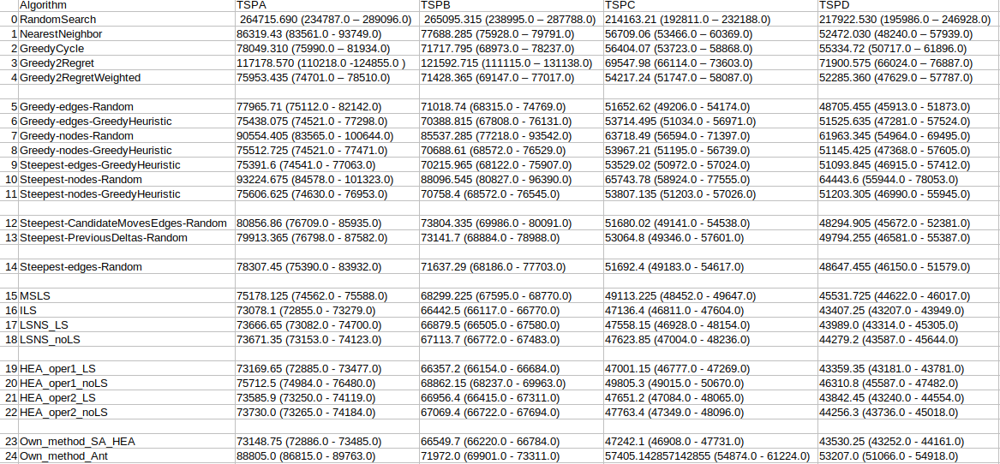
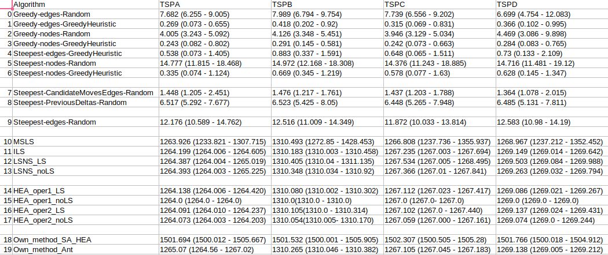
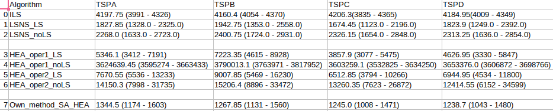
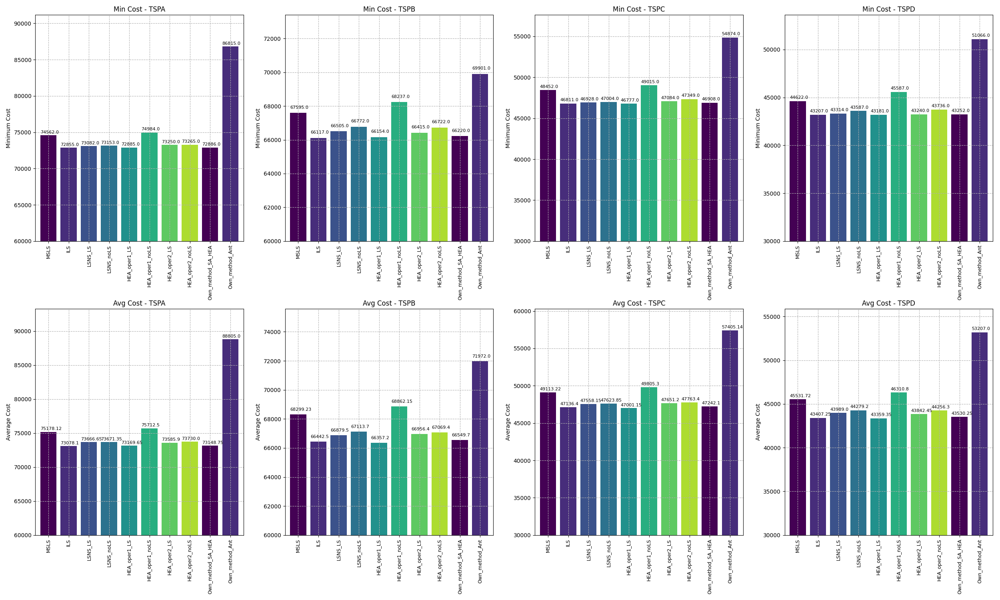
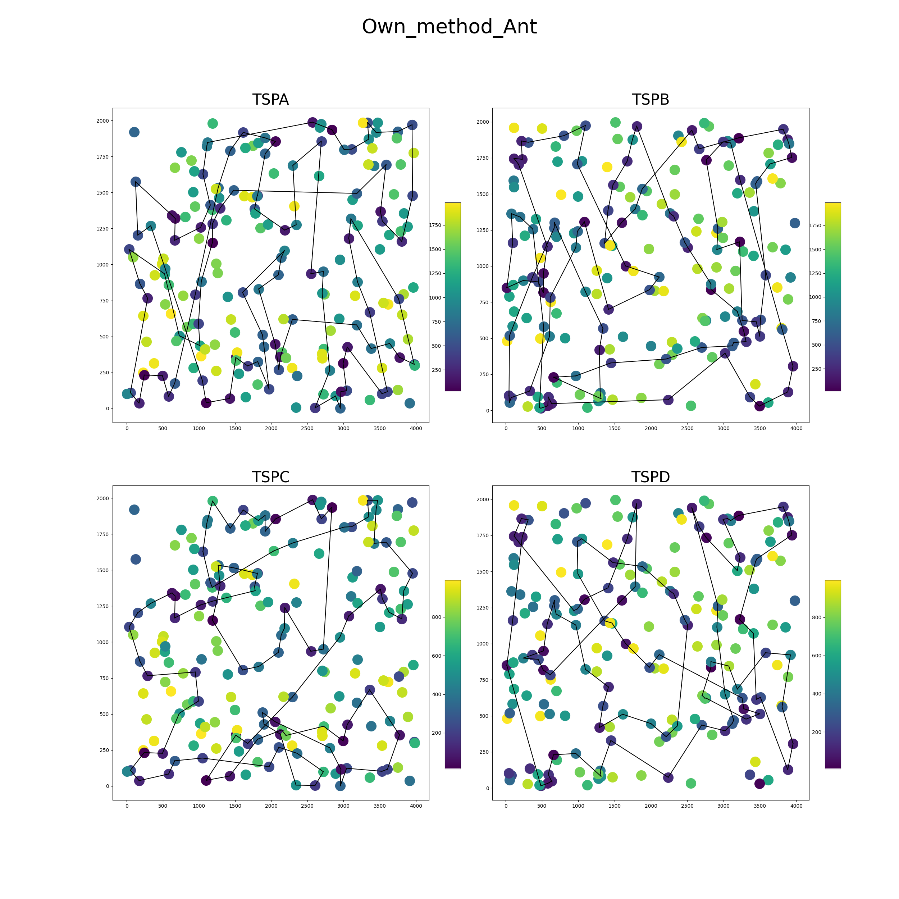

# Report

Team members:

- Sofya Aksenyuk, 150284
- Uladzimir Ivashka, 150281

## Problem Description

Given a set of nodes, each characterized by their (x, y) coordinates in a plane and an associated cost, the challenge is to select exactly 50% of these nodes and form a Hamiltonian cycle. 

The goal is to minimize the sum of the total length of the path plus the total cost of the selected nodes. 

Distances between nodes are computed as Euclidean distances and rounded to the nearest integer. 

## Methodology

### Simulated Annealing

Simulated Annealing (SA) is a probabilistic technique for approximating the global optimum of a given function. It is inspired by the process of annealing in metallurgy, a technique involving heating and controlled cooling of a material to increase the size of its crystals and reduce their defects. The algorithm starts at a high temperature and gradually cools down. At each step, it randomly selects a solution, accepting not only improvements but also, with a certain probability, worse solutions. This allows it to potentially escape local optima in the search for a global optimum. As the temperature decreases, the algorithm becomes less likely to accept worse solutions, focusing more on exploring the local neighborhood of the current solution.

### Ant Colony Optimization

Ant Colony Optimization (ACO) is a probabilistic technique used to solve computational problems which can be reduced to finding good paths through graphs. Inspired by the behavior of ants searching for food, in ACO, a number of artificial ants build solutions to the optimization problem and exchange information on their quality. Ants explore paths and deposit a virtual pheromone trail, with stronger trails indicating shorter or better paths. Future artificial ants are then more likely to follow these stronger trails. This collective learning process, based on the intensity of the pheromone trails, allows the ants to find shorter paths over time. ACO is particularly effective for problems like the traveling salesman problem or routing in networks.

## Source code

Link: [Source Code SA](https://github.com/aksenyuk/evolutionary-computation/blob/main/own-method/own_method)

Link: [Source Code ACO](https://github.com/aksenyuk/evolutionary-computation/blob/main/own-method/own_method4.py)

## Pseudocode

## Simulated Annealing in our application with HEA

    FUNCTION HEA(DistanceMatrix, Costs, EndTime, PopSize, Oper):

        StartTime = time()
        Counter = 0

        Population = (generate 20 solutions using SteepestLocalSearch)
        TotalCosts = (compute total costs for each of the solutions from population)

        WHILE (time() - StartTime < EndTime):
            Action = (randomly choose crossover or mutation with different probabilities)

            IF (Action is crossover):
                Parent1 = (tournament selection with size 3)
                Parent2 = (tournament selection with size 3, shouldn't be same as Parent1)
                Child = (Operator_1 from previous lab)
            ELSE IF (Action is mutation):
                Parent = (tournament selection with size 3)
                Child = (apply perturbation from ILS to Parent)

            IF (choose between SteepestLocalSearch and Simulated Annealing with some probabilities):
                Child = (apply Simulated Annealing with some probability)
            ELSE:
                Child = SteepestLocalSearch(Child, DistanceMatrix, Costs)

            ChildTotalCost = GetTotalCost(Child, DistanceMatrix, Costs)
            IF (ChildTotalCost not it TotalCosts):
                MaxTotalCost, Idx = (get worst total cost and its index)
                IF (ChildTotalCost < MaxTotalCost):
                    Population[Idx] = Child
                    TotalCosts[Idx] = ChildTotalCost

            Counter += 1

        BestSolution, BestTotalCost = (get best solution from population and its total cost)

        RETURN BestSolution, BestTotalCost, Counter

        
    FUNCTION SimulatedAnnealing(InitialSolution, DistanceMatrix, Costs, T=10000, CoolingRate=0.995, StoppingTemperature=1, UseLocal)
        CurrentSolution = InitialSolution
        CurrentCost = GetTotalCost(CurrentSolution, DistanceMatrix, Costs)
        BestSolution = CurrentSolution
        BestCost = CurrentCost

        WHILE (T > StoppingTemperature):
            Neighbor = (small perturbation of CurrentSolution)
            IF (UseLocal is True):
                Neighbor = SteepestLocalSearch(Neighbor, DistanceMatrix, Costs)
            NeighborCost = GetTotalCost(Neighbor, DistanceMatrix, Costs)

            IF NeighborCost < CurrentCost OR Random(0, 1) < Exp((CurrentCost - NeighborCost) / T)
                CurrentSolution = Neighbor
                CurrentCost = NeighborCost

                IF NeighborCost < BestCost
                    BestSolution = Neighbor
                    BestCost = NeighborCost

            T = T * CoolingRate

        RETURN BestSolution

## Ant Colony Optimization

    CLASS Ant
        FUNCTION __Init__(StartNode)
            Tour = [StartNode]
            TotalCost = 0

        FUNCTION VisitNode(Node, Cost)
            Tour.Append(Node)
            TotalCost += Cost

    CLASS AntColonyOptimization
        FUNCTION __Init__(DistanceMatrix, Costs, EndTime, NAnts=20, NBest=5, Decay=0.5, Alpha=1, Beta=2)
            DistanceMatrix, Costs, NAnts, NBest, EndTime, Decay, Alpha, Beta = DistanceMatrix, Costs, NAnts, NBest, EndTime, Decay, Alpha, Beta
            PheromoneMatrix = InitializeMatrix(DistanceMatrix.Shape, 1 / Length(DistanceMatrix))

        FUNCTION _ApplyPheromoneDecay()
            PheromoneMatrix *= (1 - Decay)

        FUNCTION _UpdatePheromones(Ants)
            FOR Each Ant in Ants (Update PheromoneMatrix based on Ant's Tour and DistanceMatrix)

        FUNCTION _SelectNextNode(CurrentNode, TabooList)
            Heuristic = 1 / (DistanceMatrix[CurrentNode] + Costs), set 0 for nodes in TabooList
            Attractiveness = CalculateAttractiveness(PheromoneMatrix, Heuristic, Alpha, Beta)
            RETURN ChooseNodeBasedOnProbability(Attractiveness)

        FUNCTION _ConstructSolution()
            Ants = [Create NAnts number of Ants]
            FOR Each Step in Tour Length (Move each Ant to Next Node using _SelectNextNode and update their Tour)

            RETURN Ants

        FUNCTION Run()
            StartTime = GetCurrentTime()
            BestCost = Infinity, BestSolution = None

            WHILE (CurrentTime - StartTime < EndTime)
                Ants = _ConstructSolution()
                _ApplyPheromoneDecay()
                UpdatePheromonesForBestAnts(Ants, NBest)

                IF (Cost of Best Ant < BestCost)
                    Update BestCost and BestSolution

            RETURN BestCost, BestSolution

# Computational Experiments in our application

## Results

### Table of Cost

<!-- ### Table of Time

 -->

### Table of Iterations

### Plots of Cost

## Best Solutions Plots

See plots: [Plots](https://github.com/aksenyuk/evolutionary-computation/tree/main/own-method/plots/)

# Best solution among all methods so far

## TSPA
[48, 106, 160, 11, 152, 130, 119, 109, 189, 75, 1, 177, 41, 137, 199, 192, 175, 114, 4, 77, 43, 121, 91, 50, 149, 0, 19, 178, 164, 159, 143, 59, 147, 116, 27, 96, 185, 64, 20, 71, 61, 163, 74, 113, 195, 53, 62, 32, 180, 81, 154, 144, 141, 87, 79, 194, 21, 171, 108, 15, 117, 22, 55, 36, 132, 128, 145, 76, 161, 153, 88, 127, 186, 45, 167, 101, 99, 135, 51, 112, 66, 6, 172, 156, 98, 190, 72, 12, 94, 89, 73, 31, 111, 14, 80, 95, 169, 8, 26, 92]

**Cost:** 72855.0

## TSPB
[166, 59, 119, 193, 71, 44, 196, 117, 150, 162, 158, 67, 156, 91, 70, 51, 174, 140, 148, 141, 130, 142, 53, 69, 115, 82, 63, 8, 16, 18, 29, 33, 19, 190, 198, 135, 95, 172, 163, 182, 2, 5, 34, 183, 197, 31, 101, 38, 103, 131, 24, 127, 121, 179, 143, 122, 92, 26, 66, 169, 0, 57, 99, 50, 112, 154, 134, 25, 36, 165, 37, 137, 88, 55, 153, 80, 157, 145, 79, 136, 73, 185, 132, 52, 139, 107, 12, 189, 170, 181, 147, 159, 64, 129, 89, 58, 171, 72, 114, 85]    

**Cost:** 66117.0

## TSPC
[20, 71, 61, 163, 74, 113, 195, 53, 62, 32, 180, 81, 154, 102, 144, 141, 87, 79, 194, 21, 171, 108, 15, 117, 22, 55, 36, 132, 128, 145, 76, 161, 153, 88, 127, 186, 45, 167, 101, 99, 135, 51, 5, 112, 72, 190, 66, 6, 172, 156, 98, 94, 42, 89, 12, 73, 31, 95, 169, 8, 26, 92, 48, 106, 160, 11, 152, 130, 119, 109, 189, 75, 1, 177, 41, 137, 199, 192, 43, 77, 4, 114, 91, 121, 50, 149, 0, 69, 19, 178, 164, 159, 143, 59, 147, 116, 27, 96, 185, 64]

**Cost:** 46777.0

## TSPD
[47, 170, 181, 147, 159, 64, 129, 89, 58, 171, 72, 114, 85, 166, 71, 44, 196, 117, 150, 162, 158, 67, 3, 156, 91, 70, 51, 174, 140, 148, 141, 130, 142, 53, 32, 113, 69, 115, 82, 63, 8, 16, 18, 29, 33, 19, 190, 198, 135, 169, 66, 26, 92, 122, 143, 179, 197, 183, 34, 31, 101, 38, 103, 131, 121, 127, 24, 50, 43, 99, 137, 37, 165, 123, 154, 134, 25, 36, 88, 55, 4, 153, 80, 157, 145, 79, 136, 61, 73, 185, 132, 52, 12, 107, 97, 139, 193, 119, 59, 189]  

**Cost:** 43181.0

# Conclusions

- Own_method_SA_HEA performs relatively same as HEA_Oper_1 and ILS, despite much less number of iterations.
- Ant colony doesn't performs as good as expected, beign the worst algo among last ones. Note that due to technical issues ACO was run only for 7 repetitions.

